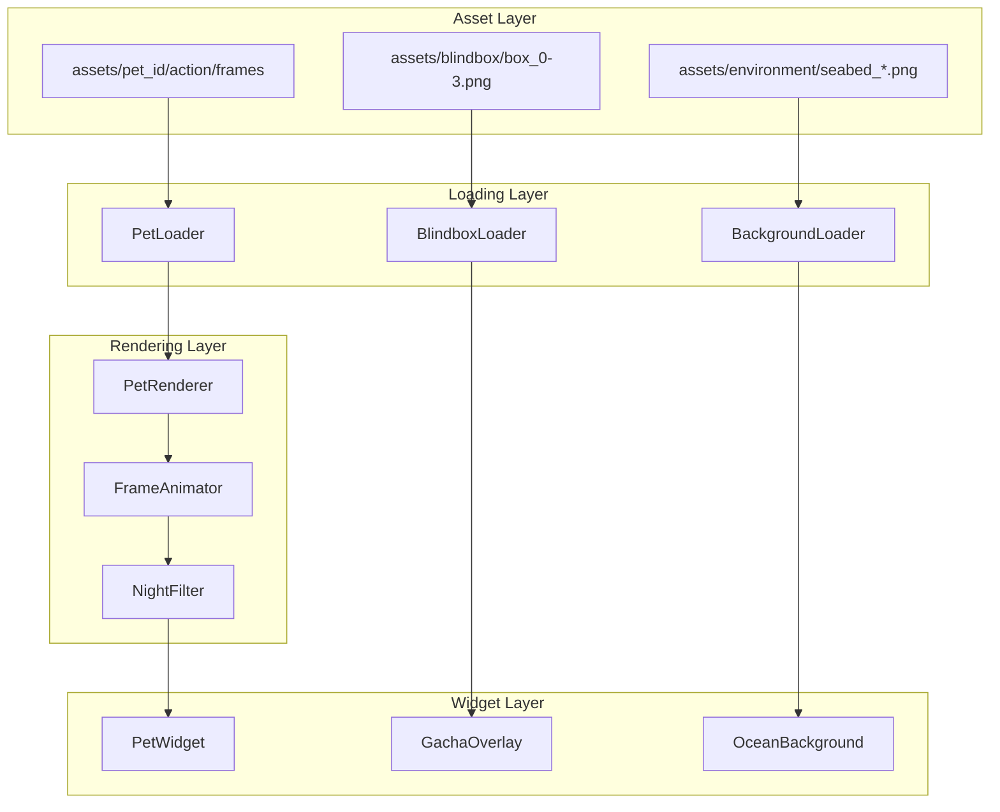

# Design Document: V9 Asset Integration

## Overview

V9 资产集成将已完成的美术资产正确集成到 PufferPet 应用中。主要涉及四个核心系统的重构：

1. **PetLoader** - 资源加载器，适配新的嵌套文件夹结构
2. **PetRenderer** - 渲染器，实现尺寸缩放和序列帧动画
3. **PetWidget** - 交互组件，实现生命周期交互逻辑
4. **NightFilter** - 夜间滤镜，实现分类颜色叠加

## Architecture



## Components and Interfaces

### 1. PetLoader (pet_core.py)

负责从新的嵌套文件夹结构加载宠物资源。

```python
class PetLoader:
    """V9 资源加载器 - 适配嵌套文件夹结构"""
    
    # 动作映射: (stage, is_moving) -> action_folder
    ACTION_MAP = {
        (0, False): 'baby_sleep',   # Stage 0: 休眠
        (1, True): 'baby_swim',     # Stage 1: 幼年游动
        (1, False): 'baby_swim',    # Stage 1: 幼年静止也用swim
        (2, True): 'swim',          # Stage 2: 成年游动
        (2, False): 'sleep',        # Stage 2: 成年静止
    }
    
    INTERACTION_ACTIONS = ['angry', 'drag_h', 'drag_v']
    FRAME_COUNT = 4  # 每个动作4帧
    
    @staticmethod
    def get_frame_path(pet_id: str, action: str, frame_index: int) -> str:
        """构建帧路径: assets/{pet_id}/{action}/{pet_id}_{action}_{index}.png"""
        
    @staticmethod
    def load_action_frames(pet_id: str, action: str) -> List[QPixmap]:
        """加载指定动作的所有帧"""
        
    @staticmethod
    def get_action_for_state(stage: int, is_moving: bool) -> str:
        """根据状态获取动作名称"""
```

### 2. PetRenderer (pet_core.py)

负责尺寸计算和图像缩放。

```python
class PetRenderer:
    """V9 渲染器 - 尺寸缩放系统"""
    
    # 尺寸常量
    ORIGINAL_SIZE = 350      # 原图尺寸
    BASE_SIZE = 100          # 幼年基准尺寸
    ADULT_MULTIPLIER = 1.5   # 成年倍率
    RAY_MULTIPLIER = 1.5     # Ray 种族倍率
    ICON_SIZE = 64           # 背包图标尺寸
    ICON_ORIGINAL = 1500     # 图标原图尺寸
    
    @staticmethod
    def calculate_size(pet_id: str, stage: str) -> int:
        """
        计算显示尺寸
        
        公式: BASE_SIZE × stage_multiplier × species_multiplier
        - stage_multiplier: adult=1.5, baby/dormant=1.0
        - species_multiplier: ray=1.5, others=1.0
        """
        
    @staticmethod
    def scale_frame(pixmap: QPixmap, target_size: int) -> QPixmap:
        """将350px原图缩放到目标尺寸"""
```

### 3. FrameAnimator (pet_core.py)

负责序列帧动画播放。

```python
class FrameAnimator:
    """V9 帧动画器"""
    
    NORMAL_FPS = 8      # 正常帧率
    DORMANT_FPS = 4     # 休眠帧率（更慢）
    
    def __init__(self, frames: List[QPixmap]):
        self.frames = frames
        self.current_frame = 0
        self.timer = QTimer()
        
    def start(self, fps: int = NORMAL_FPS):
        """开始播放动画"""
        
    def stop(self):
        """停止动画"""
        
    def get_current_frame(self) -> QPixmap:
        """获取当前帧"""
        
    def reset(self):
        """重置到第0帧"""
```

### 4. NightFilter (theme_manager.py)

负责夜间模式颜色滤镜。

```python
class NightFilter:
    """V9 夜间滤镜 - 分类颜色叠加"""
    
    # 颜色分组
    GREEN_GROUP = ['puffer', 'starfish']  # 绿色组
    PURPLE_GROUP = ['crab', 'jelly', 'ray']  # 紫色组
    
    # 滤镜颜色
    GREEN_OVERLAY = QColor(0, 255, 136, 51)   # #00FF88, 0.2 opacity
    PURPLE_OVERLAY = QColor(139, 0, 255, 51)  # #8B00FF, 0.2 opacity
    
    @staticmethod
    def get_overlay_color(pet_id: str) -> QColor:
        """根据宠物ID获取叠加颜色"""
        
    @staticmethod
    def apply_filter(pixmap: QPixmap, pet_id: str) -> QPixmap:
        """应用夜间滤镜"""
```

### 5. FlipTransform (pet_core.py)

负责拖拽翻转逻辑。

```python
class FlipTransform:
    """V9 翻转变换"""
    
    @staticmethod
    def should_flip_horizontal(delta_x: int) -> bool:
        """判断是否需要水平翻转: delta_x < 0"""
        return delta_x < 0
    
    @staticmethod
    def should_flip_vertical(delta_y: int) -> bool:
        """判断是否需要垂直翻转: delta_y > 0"""
        return delta_y > 0
    
    @staticmethod
    def apply_horizontal_flip(pixmap: QPixmap) -> QPixmap:
        """应用水平镜像"""
        
    @staticmethod
    def apply_vertical_flip(pixmap: QPixmap) -> QPixmap:
        """应用垂直翻转"""
```

## Data Models

### ActionState Enum

```python
from enum import Enum

class ActionState(Enum):
    """宠物动作状态"""
    BABY_SLEEP = 'baby_sleep'   # Stage 0: 休眠
    BABY_SWIM = 'baby_swim'     # Stage 1: 幼年游动
    SWIM = 'swim'               # Stage 2: 成年游动
    SLEEP = 'sleep'             # Stage 2: 成年静止
    ANGRY = 'angry'             # 愤怒
    DRAG_H = 'drag_h'           # 水平拖拽
    DRAG_V = 'drag_v'           # 垂直拖拽
```

### FrameCache

```python
@dataclass
class FrameCache:
    """帧缓存数据结构"""
    pet_id: str
    action: str
    frames: List[QPixmap]
    scaled_size: int
    last_accessed: float
```

## Correctness Properties

*A property is a characteristic or behavior that should hold true across all valid executions of a system-essentially, a formal statement about what the system should do. Properties serve as the bridge between human-readable specifications and machine-verifiable correctness guarantees.*

### Property 1: Path Construction Correctness

*For any* valid pet_id, action_name, and frame_index (0-3), the constructed path SHALL match the pattern `assets/{pet_id}/{action}/{pet_id}_{action}_{index}.png`

**Validates: Requirements 1.1**

### Property 2: Stage to Action Mapping

*For any* pet in a given stage (0, 1, or 2) and movement state (moving or idle), the loader SHALL return the correct action folder:
- Stage 0 → baby_sleep
- Stage 1 → baby_swim
- Stage 2 + moving → swim
- Stage 2 + idle → sleep

**Validates: Requirements 1.2, 1.3, 1.4, 1.5**

### Property 3: Size Calculation Correctness

*For any* pet_id and stage, the calculated size SHALL equal:
- BASE_SIZE (100) × ADULT_MULTIPLIER (1.5 if adult, 1.0 otherwise) × RAY_MULTIPLIER (1.5 if ray, 1.0 otherwise)

**Validates: Requirements 2.2, 2.3, 2.4**

### Property 4: Baby Interaction Blocking

*For any* pet in Stage 1 (Baby), click and drag events SHALL be ignored while right-click context menu SHALL remain functional

**Validates: Requirements 3.3, 3.4, 3.5**

### Property 5: Horizontal Flip Logic

*For any* horizontal drag with delta_x, the flip transformation SHALL be:
- delta_x >= 0 → no transformation
- delta_x < 0 → horizontal mirror flip

**Validates: Requirements 5.1, 5.2**

### Property 6: Vertical Flip Logic

*For any* vertical drag with delta_y, the flip transformation SHALL be:
- delta_y <= 0 → no transformation
- delta_y > 0 → vertical flip

**Validates: Requirements 5.3, 5.4**

### Property 7: Night Filter Color Selection

*For any* pet_id in halloween mode, the overlay color SHALL be:
- puffer, starfish → green (#00FF88) with 0.2 opacity
- crab, jelly, ray → purple (#8B00FF) with 0.2 opacity

**Validates: Requirements 6.2, 6.3**

### Property 8: Frame Cycling

*For any* frame sequence with 4 frames, the animator SHALL cycle through indices 0→1→2→3→0 and reset to 0 on state change

**Validates: Requirements 7.1, 7.2, 7.3**

### Property 9: Fallback to Placeholder

*For any* missing image file, the loader SHALL return a valid geometric placeholder instead of null or error

**Validates: Requirements 1.9, 6.4**

## Error Handling

1. **Missing Asset Files**: 使用 V7 几何占位符系统作为回退
2. **Invalid Frame Index**: 自动 clamp 到 0-3 范围
3. **Unknown Pet ID**: 使用默认 circle 形状和灰色
4. **Corrupted Image**: 检测空文件或无效图像，回退到占位符

## Testing Strategy

### Property-Based Testing

使用 **Hypothesis** 库进行属性测试：

1. **Path Construction**: 生成随机 pet_id/action/index，验证路径格式
2. **Size Calculation**: 生成随机 pet_id/stage 组合，验证尺寸公式
3. **Flip Logic**: 生成随机 delta 值，验证翻转决策
4. **Color Selection**: 遍历所有 pet_id，验证颜色分组
5. **Frame Cycling**: 模拟多次帧更新，验证循环行为

### Unit Tests

1. **PetLoader**: 测试路径构建、帧加载、回退机制
2. **PetRenderer**: 测试尺寸计算、图像缩放
3. **FrameAnimator**: 测试动画播放、暂停、重置
4. **NightFilter**: 测试颜色选择、滤镜应用
5. **FlipTransform**: 测试翻转判断、图像变换

### Integration Tests

1. **Stage Transition**: 测试 Stage 0→1→2 的动画切换
2. **Interaction Flow**: 测试点击、拖拽、愤怒触发流程
3. **Theme Switch**: 测试昼夜模式切换时的滤镜应用
